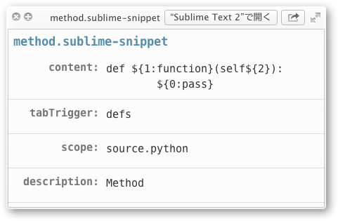

#SublimeSnippetQL
QuickLook Plugin for sublime-snippet and tmSnippet.

#Download
binary is here <http://hetima.com/tmp/SublimeSnippetQL.zip>

#Install
- place into  <code>~/Library/QuickLook</code>.
- exec <code>qlmanage -r</code> if needed.

#License
MIT License  
(C)2013 hetima.